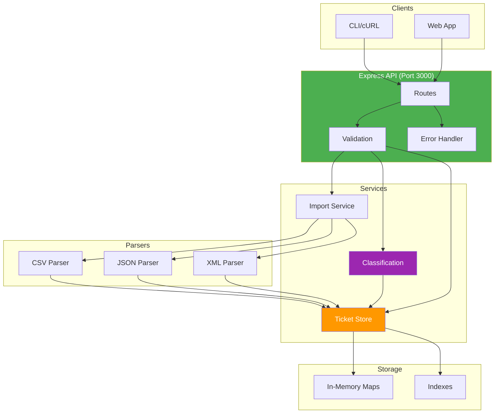

# Ticket Management System (Concise Guide)

> **Student Name**: [H. Bondarenko]
> **Date Submitted**: [Feb 1 2025]
> **AI Tools Used**: Claude Code (Claude Sonnet 4.5), OpenAI Codex (gpt-5.1-codex-mini, gpt-5.2, gpt-5.2-codex)

## What it is
An Express + TypeScript API for support tickets with import (CSV/JSON/XML), validation, auto-classification, filtering, and fast in-memory storage.

## Architecture



## TL;DR Setup
**Quick Start (Recommended)**:
```bash
cd demo
./run.sh        # Auto-installs, builds, and starts server
```

**Manual Setup**:
```bash
npm install
npm run dev     # http://localhost:3000
curl http://localhost:3000/health
```
Build/start prod: `npm run build && npm start`

**See full instructions**: [HOWTORUN.md](HOWTORUN.md)

## Core Endpoints
- `POST /tickets` (+ `?autoClassify=true`) — create.
- `GET /tickets` — list/filter by `category|priority|status|customer_id|assigned_to`.
- `GET /tickets/:id` — fetch one.
- `PUT /tickets/:id` — update (sets `classification.manually_classified` on category/priority overrides).
- `DELETE /tickets/:id` — delete.
- `POST /tickets/import` — bulk import CSV/JSON/XML; returns total/success/failed/errors; HTTP 200/207/400 based on result.
- `POST /tickets/:id/auto-classify` — classify existing ticket.

## Ticket Fields (spec)
- Status: `new | in_progress | waiting_customer | resolved | closed`
- Category: `account_access | technical_issue | billing_question | feature_request | bug_report | other`
- Priority: `urgent | high | medium | low`
- Metadata: `source (web_form|email|api|chat|phone)`, `device_type (desktop|mobile|tablet)`

## Handy cURL
Create:
```bash
curl -X POST http://localhost:3000/tickets \
  -H "Content-Type: application/json" \
  -d '{"customer_id":"C1","customer_email":"a@b.com","customer_name":"Ada",
       "subject":"Login issue","description":"Cannot access account",
       "metadata":{"source":"web_form","device_type":"desktop"}}'
```
Import CSV (auto-classify):
```bash
curl -X POST http://localhost:3000/tickets/import \
  -H "Content-Type: application/json" \
  -d '{"content": "customer_id,customer_email,customer_name,subject,description,source,device_type\nC1,a@b.com,Ada,Login fail,Cannot login,web_form,desktop",
       "fileType":"csv","autoClassify":true}'
```

## Commands
- **Quick Start**: `cd demo && ./run.sh` (auto-installs, builds, starts)
- **API Demos**: `cd demo && ./demo.sh` (requires server running)
- Dev: `npm run dev`
- Tests: `npm test`
- Coverage: `TMPDIR=./.tmp npm run test:coverage` (set TMPDIR if sandbox blocks `/tmp`)
- Lint: `npm run lint`

## Project Structure
- `src/` app.ts, server.ts, routes, middleware, services, models
- `tests/` test suites + helpers/fixtures (malformed cases)
- `fixtures/` sample import data (valid + invalid)
- `demo/` run.sh (start server), demo.sh (API demos), test-requests.http
- `docs/` API reference, architecture, testing guide
- `HOWTORUN.md` detailed setup and running instructions

## Performance snapshot
- Create 1000 tickets ≈ 0.66 ms each
- 100 filtered queries ≈ 0.45 ms each
- Import 500 CSV tickets ≈ 38 ms total

## Troubleshooting
- Port busy: `PORT=3001 npm run dev`
- Validation errors: check response JSON `error/details`
- Coverage EPERM: set writable `TMPDIR` (see coverage command above)
