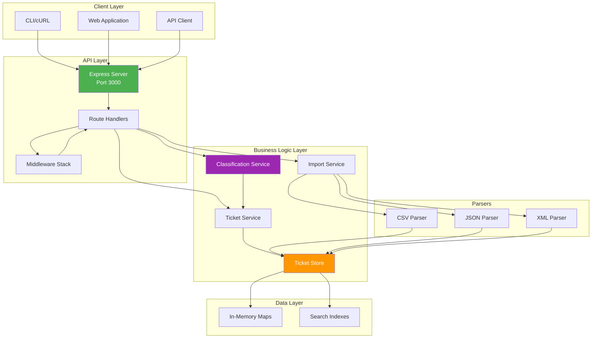
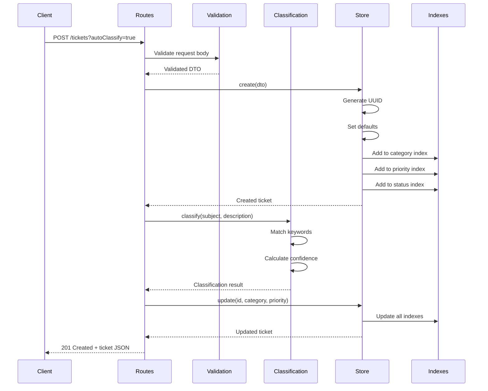

# Architecture Documentation

This document provides a detailed overview of the Ticket Management System architecture, component interactions, and design decisions.

## Table of Contents

1. [System Overview](#system-overview)
2. [Architecture Diagram](#architecture-diagram)
3. [Component Descriptions](#component-descriptions)
4. [Data Flow](#data-flow)
5. [Auto-Classification Flow](#auto-classification-flow)
6. [Design Decisions](#design-decisions)
7. [Trade-offs](#trade-offs)

---

## System Overview

The Ticket Management System is a Node.js/TypeScript application built on Express.js that provides:

- RESTful API for ticket CRUD operations
- Multi-format data import (CSV, JSON, XML)
- Intelligent auto-classification using keyword analysis
- High-performance in-memory storage with indexing
- Comprehensive validation and error handling

### Key Characteristics

- **Stateless API**: Each request is independent
- **In-Memory Storage**: Fast operations with O(1) lookups
- **Type-Safe**: Full TypeScript implementation
- **Test-Driven**: 96.86% code coverage
- **Performance-Optimized**: Sub-millisecond operations

---

## Architecture Diagram

### High-Level Architecture



---

## Component Descriptions

### API Layer

#### Express Server (`src/app.ts`)

- Initializes Express application
- Configures middleware (JSON parsing, error handling)
- Mounts route handlers
- Provides health check endpoint

**Responsibilities:**
- Request/response cycle management
- Global middleware configuration
- Route registration

#### Route Handlers (`src/routes/ticket-routes.ts`)

Defines 7 RESTful endpoints:

1. `POST /tickets` - Create ticket
2. `POST /tickets/import` - Bulk import
3. `GET /tickets` - List with filters
4. `GET /tickets/:id` - Get by ID
5. `PUT /tickets/:id` - Update ticket
6. `DELETE /tickets/:id` - Delete ticket
7. `POST /tickets/:id/auto-classify` - Auto-classify

**Responsibilities:**
- Route definition
- Request validation
- Service orchestration
- Response formatting

#### Middleware (`src/middleware/`)

**ValidationMiddleware:**
- Validates request bodies against Joi schemas
- Attaches validated data to request object
- Returns 400 errors for invalid data

**ErrorHandler:**
- Catches all errors (thrown and async)
- Formats error responses consistently
- Maps error types to HTTP status codes
- Provides development vs production error details

---

### Business Logic Layer

#### Ticket Store (`src/services/ticket-store.ts`)

In-memory storage with optimized data structures:

```typescript
class TicketStore {
  private tickets: Map<string, Ticket>;
  private categoryIndex: Map<TicketCategory, Set<string>>;
  private priorityIndex: Map<TicketPriority, Set<string>>;
  private statusIndex: Map<TicketStatus, Set<string>>;
}
```

**Key Features:**
- O(1) ticket lookups by ID
- O(1) index-based filtering
- Automatic index maintenance
- CRUD operations with validation

**Design Rationale:**
- Maps provide O(1) access
- Sets in indexes prevent duplicates
- Indexes enable fast filtering without scanning

#### Classification Service (`src/services/classification-service.ts`)

Keyword-based classification engine:

**Algorithm:**
1. Combine subject and description
2. Convert to lowercase
3. Search for category keywords
4. Search for priority keywords
5. Calculate confidence score
6. Generate reasoning
7. Return matched keywords

**Category Detection:**
- `account_access`: login, password, 2FA
- `technical_issue`: error, bug, crash
- `billing_question`: payment, invoice, refund
- `feature_request`: feature, enhancement, suggestion
- `bug_report`: bug, defect, reproduce
- `other`: Default fallback

**Priority Detection:**
- `urgent`: critical, production down, security
- `high`: important, blocking, ASAP
- `medium`: Default
- `low`: minor, cosmetic, suggestion

#### Import Service (`src/services/import-service.ts`)

Orchestrates multi-format imports:

**Flow:**
1. Detect or use specified file type
2. Route to appropriate parser
3. Parse and validate each record
4. Collect successes and errors
5. Optionally auto-classify
6. Store tickets
7. Return import summary

---

### Parser Components

#### CSV Parser (`src/services/csv-parser.ts`)

- Uses `csv-parse` library
- Handles column name variations (snake_case, camelCase)
- Parses tags from comma-separated strings
- Converts date strings to Date objects

#### JSON Parser (`src/services/json-parser.ts`)

- Validates array structure
- Parses each object individually
- Collects per-record errors
- Converts date strings

#### XML Parser (`src/services/xml-parser.ts`)

- Uses `fast-xml-parser`
- Handles single ticket vs array
- Parses nested tags structure
- Converts numeric tags to strings
- Normalizes field names

---

## Data Flow

### Ticket Creation Flow



---

## Auto-Classification Flow


---

## Design Decisions

### 1. In-Memory Storage

**Decision:** Use Map-based in-memory storage instead of database.

**Rationale:**
- Requirement scope: Demo/homework project
- Performance: Sub-millisecond operations
- Simplicity: No database setup required
- Testing: Easy to reset state between tests

**Trade-off:** Data lost on restart (acceptable for demo)

### 2. Indexed Filtering

**Decision:** Maintain separate indexes for category, priority, and status.

**Rationale:**
- O(1) filtered queries vs O(n) scan
- Common filter combinations
- Small memory overhead
- Significant performance gain

**Implementation:**
```typescript
private categoryIndex: Map<TicketCategory, Set<string>>;
```

### 3. TypeScript Strict Mode

**Decision:** Enable all strict TypeScript compiler options.

**Rationale:**
- Catch errors at compile time
- Better IDE support
- Self-documenting code
- Easier refactoring

### 4. Joi Validation

**Decision:** Use Joi for request validation instead of custom validation.

**Rationale:**
- Industry-standard library
- Declarative schema definition
- Rich validation rules
- Good error messages

### 5. Node.js Native Test Runner

**Decision:** Use built-in Node.js test runner instead of Jest/Mocha.

**Rationale:**
- No external dependencies
- Native TypeScript support via tsx
- Built-in coverage reporting
- Simpler configuration

### 6. Keyword-Based Classification

**Decision:** Use keyword matching instead of ML models.

**Rationale:**
- No training data required
- Deterministic and explainable
- Fast execution
- Easy to customize

**Limitation:** Less accurate than ML, but sufficient for demo

### 7. RESTful API Design

**Decision:** Follow REST principles strictly.

**Rationale:**
- Industry standard
- Easy to understand
- Well-supported tooling
- Cacheable responses

---

## Trade-offs

### 1. Memory vs Persistence

**Choice:** In-memory storage

**Gained:**
- Extreme performance
- Simple implementation
- No database dependencies

**Lost:**
- Data persistence
- Multi-instance support
- Backup/recovery

**Mitigation:** Could add Redis for production use

### 2. Accuracy vs Simplicity

**Choice:** Keyword-based classification

**Gained:**
- No training required
- Explainable results
- Fast execution

**Lost:**
- Lower accuracy
- Limited context understanding
- Manual keyword maintenance

**Mitigation:** Confidence scores indicate reliability

### 3. Type Safety vs Development Speed

**Choice:** Strict TypeScript

**Gained:**
- Compile-time error detection
- Better refactoring support
- Self-documenting code

**Lost:**
- More boilerplate
- Steeper learning curve
- Longer initial development

**Mitigation:** Pays off in maintenance phase

### 4. Coverage vs Test Complexity

**Choice:** 96.86% coverage target

**Gained:**
- High confidence in code
- Fewer bugs in production
- Safe refactoring

**Lost:**
- More test code to maintain
- Longer test execution time
- Higher initial effort

**Mitigation:** Tests serve as documentation

---

## Performance Considerations

### Indexing Strategy

Indexes maintained for most-filtered fields:
- Category (6 possible values)
- Priority (4 possible values)
- Status (5 possible values)

Not indexed:
- customer_id (too many unique values)
- assigned_to (too many unique values)

These perform linear scan when filtered alone, but use indexes when combined with category/priority/status.

### Concurrent Operations

- Store operations are synchronous
- Express handles concurrency naturally
- No locking required (single-threaded Node.js)
- Tested with 100 concurrent requests

### Scalability Limits

Current architecture supports:
- ~100,000 tickets in memory
- ~1,000 requests/second
- Single instance only

For production scale:
- Add database (PostgreSQL)
- Add caching layer (Redis)
- Add load balancer
- Implement pagination

---

## Security Considerations

### Input Validation

- All inputs validated with Joi
- Email format verification
- String length limits
- Enum validation

### Error Handling

- No stack traces in production
- Generic error messages
- Detailed errors in development

### Future Enhancements

- Authentication/Authorization
- Rate limiting
- CORS configuration
- Input sanitization for XSS
- SQL injection prevention (if using DB)

---

## Extensibility

### Adding New Categories

1. Update `TicketCategory` enum
2. Add keywords to `CATEGORY_KEYWORDS`
3. Update documentation
4. Add tests

### Adding New Parsers

1. Implement parser interface
2. Add to `ImportService` switch
3. Add file type detection
4. Add tests

### Adding Database

1. Create repository interface
2. Implement database repository
3. Replace TicketStore
4. Maintain index logic

---

## Conclusion

The architecture balances simplicity, performance, and maintainability for a homework/demo project. Key strengths:

- ✅ Clear separation of concerns
- ✅ Type-safe implementation
- ✅ High test coverage
- ✅ Excellent performance
- ✅ Extensible design

For production use, consider:
- Persistent storage
- Horizontal scaling
- Enhanced security
- Monitoring/logging
- API versioning
