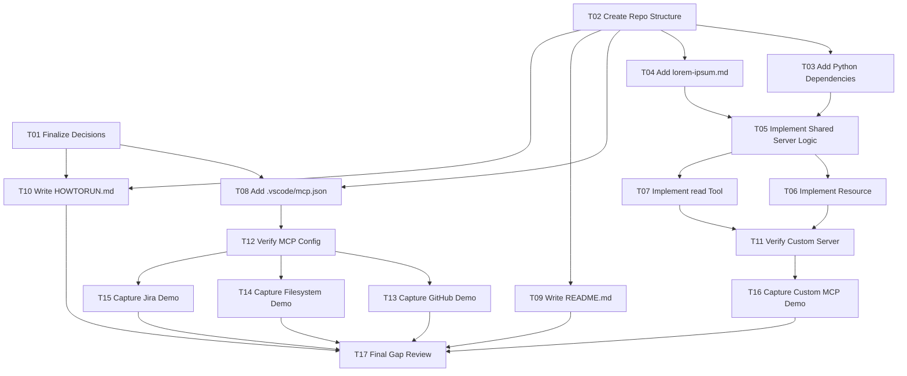

# Tasks

## Purpose

Break the approved design into concrete implementation steps.

## Status

Proposed

## Work Items

- [ ] T01: Finalize the remaining implementation decisions:
  - set the maximum allowed `word_count`
  - decide how Jira evidence will be documented while keeping project-specific values sanitized
- [ ] T02: Create the repository structure required by the homework:
  - `.vscode/`
  - `custom-mcp-server/`
  - `docs/screenshots/`
- [ ] T03: Add custom server dependency management in `custom-mcp-server/requirements.txt` with `fastmcp` explicitly included.
- [ ] T04: Add `custom-mcp-server/lorem-ipsum.md` with enough content to support the required word-limited reads.
- [ ] T05: Implement shared custom server logic for:
  - loading `lorem-ipsum.md`
  - whitespace-based word counting
  - exact word slicing
  - validation and clear error handling
- [ ] T06: Implement the FastMCP resource in `custom-mcp-server/server.py` with parameterized `word_count` support and default `30`.
- [ ] T07: Implement the FastMCP `read` tool in `custom-mcp-server/server.py` using the same shared logic as the resource.
- [ ] T08: Add `.vscode/mcp.json` with repo-local server definitions for:
  - GitHub MCP
  - Filesystem MCP
  - Jira MCP
  - the custom FastMCP server
- [ ] T09: Write `README.md` with submission overview, author section, and repository contents.
- [ ] T10: Write `HOWTORUN.md` with:
  - dependency installation
  - custom server startup
  - VS Code MCP usage
  - Codex adaptation guidance
  - validation steps for each integration
  - screenshot guidance and redaction notes
- [ ] T11: Verify the custom server locally:
  - syntax validation
  - startup validation
  - resource behavior checks
  - tool behavior checks
  - validation and error-path checks
- [ ] T12: Verify the repo-local MCP configuration in the target workflow as far as possible from the local environment.
- [ ] T13: Run and capture the GitHub MCP demo against this repository.
- [ ] T14: Run and capture the Filesystem MCP demo against this repository.
- [ ] T15: Run and capture the Jira MCP demo for the last 5 bug tickets with redaction as needed.
- [ ] T16: Run and capture the custom MCP demo for both the resource and `read` tool.
- [ ] T17: Review the repository against `TASKS.md`, update any earlier spec mistakes discovered during implementation, and close remaining gaps.

## Task Graph

## Parallel Work

- Stream A: T03 and T04 can be completed together once T02 creates the folder structure.
- Stream B: T09 can proceed in parallel with early implementation work after T02 because it depends mostly on agreed scope, not finished code.
- Stream C: T08 and T10 can be completed in parallel once T01 fixes the remaining configuration and validation decisions.
- Stream D: T13, T14, T15, and T16 can be executed in parallel after T11 and T12 complete, subject to external credentials and client availability.
- Stream E: T17 remains intentionally serial because it reconciles the outputs of all earlier streams and pushes any discovered corrections back into prior specs.

## Order of Execution

1. Resolve the remaining decisions in T01 so config and validation behavior are fixed.
2. Create the basic repository structure in T02.
3. In parallel:
   - complete T03 and T04 for the custom server inputs
   - start T09 for the repository overview draft
4. Implement the custom server core in sequence:
   - T05
   - T06
   - T07
5. In parallel:
   - complete T08 for repo-local MCP configuration
   - complete T10 for run instructions and Codex mapping
6. Verify implementation:
   - T11 for the custom server
   - T12 for the MCP configuration
7. After verification, capture evidence in parallel where external access allows:
   - T13 GitHub
   - T14 Filesystem
   - T15 Jira
   - T16 custom MCP
8. Finish with T17 to reconcile the repository against the assignment and update earlier specs if implementation revealed mistakes.

## Dependencies

- T01 must complete before the final Jira demo flow and before finalizing validation behavior in docs.
- T02 is the structural prerequisite for all file-based implementation work.
- T03 and T04 are prerequisites for T05.
- T05 is the prerequisite for T06 and T07.
- T06 and T07 are prerequisites for T11.
- T08 is the prerequisite for T12.
- T12 is the prerequisite for T13, T14, and T15.
- T11 is the prerequisite for T16.
- T09, T10, and T13 through T16 should all be complete before T17.

## Blockers

- GitHub, Jira, and some MCP client flows depend on working external authentication and local client support.
- Screenshot collection requires a functioning MCP client session and access to capture the visible results.

## Notes

- Parallelizable workstreams:
  - T03, T04, and T09 can proceed in parallel after T02.
  - T08 and T10 can proceed in parallel after the main design choices are fixed.
  - T13, T14, T15, and T16 can proceed in parallel after verification, subject to credential availability and client readiness.
- T17 is explicitly responsible for feeding corrections back into earlier spec files if implementation exposes a mistake in requirements, design, or task planning.
- The task graph is intentionally dependency-based rather than calendar-based so execution can adapt to external authentication delays.
